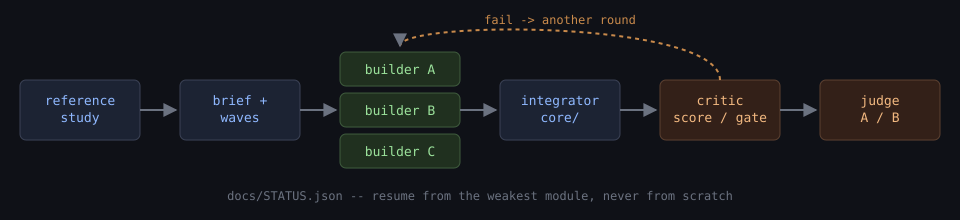

# game-maker

<p align="center">
  
</p>

A harness for building **any game** from a description and references (city
builder, RTS, action, shooter, racing, open world, platformer, puzzle, 3D or
2D) to a stated visual and gameplay bar, with a fleet of agents that build,
integrate, critique and judge each other's work.

Works identically in **Claude Code** and **Codex CLI** (and anything else
that reads the [Agent Skills](https://agentskills.io) standard), from one
copy of the skill.

---

## Where this comes from

This harness formalises a prompt posted to
[r/ClaudeCode](https://www.reddit.com/r/ClaudeCode/comments/1w4qziv/ok_this_is_wild_used_claude_fable_51_and_said/)
by u/DesignEddi, who gave Claude Code a single prompt: "build a Cities:
Skylines II-class city builder in Three.js", with instructions to write its
own architecture, spin up a swarm of builder agents, and grade its own work
with a separate critic before calling anything done. The result was a
long-running, mostly unsupervised build that produced a genuinely
good-looking scene from one message.

`.agents/skills/game-maker/references/field-notes.md` records what is
verifiable from that thread (timings, token counts, what the author said
about the process). `references/prompt-analysis.md` is a line-by-line
critique of the original prompt: what to keep verbatim, where it would
stall or lie in practice, and fifteen fixes that each widen what counts as
proof without narrowing how a builder is allowed to reach the bar. The rest
of the skill generalises the method (reference study, genre-derived module
decomposition, the builder/integrator/critic/judge loop, persisted state)
so it targets *any* game, not only that one city builder.

## Quick start

```
cd your-empty-project/
# copy .agents/, .claude/, AGENTS.md, CLAUDE.md from this repo in
```

Then, in Claude Code or Codex CLI:

```
Build a <your game idea> in <your stack>. References: <paste image paths,
a link, or named titles it should look like>. Use the game-maker skill.
```

or, with no references at all:

```
Build me a game like <title>. Use the game-maker skill.
```

The skill studies whatever references it's given, derives the module list
and build order from the genre, writes the architecture and a
screenshot/log verification harness before any feature code, then fans out
one builder agent per module, gauntlets every round with an art-director
critic that takes its own screenshots and scores against a written rubric,
and loops (resuming from the weakest module, never from scratch) until
every module passes or hits a documented ceiling.

If your host supports multi-agent orchestration ("ultracode" / Workflow),
the skill uses it; otherwise it runs the same roles as sequential agent
calls. Either way the contract (one folder per builder, no claim without a
screenshot someone opened and looked at, honest scores) is identical.

## Layout

```
.agents/skills/          the skill itself (Agent Skills REPO scope)
  game-maker/             SKILL.md + references/ + scripts/
.agents/agents/           subagent definitions used by the orchestration
  game-builder.md          owns one module folder, ships a showcase, captures evidence
  game-integrator.md       the only agent allowed to touch core/
  game-critic.md           scores modules against the rubric, writes no code
  game-judge.md            blind A/B judging at the final gate
.claude/skills            symlink -> ../.agents/skills
.claude/agents            symlink -> ../.agents/agents
AGENTS.md                 the harness contract
CLAUDE.md                 symlink -> AGENTS.md
```

Nothing is duplicated between agent frameworks. `.claude/` holds symlinks
only, so a change to the skill or an agent definition is a change
everywhere at once. A `workspace/` (or wherever you point it) holds the
actual game projects this skill builds. None is checked into this repo,
which ships the method, not a game.

## The loop, in one screen

```
description + references
  ─► reference study  → docs/REFERENCE.md   (checkable look targets)
  ─► brief + genre playbook → module list, waves, definition of done
  ─► ARCHITECTURE.md + DECISIONS.md + core/ + capture tool
  ─► builders in parallel, one per module folder
  ─► integrator merges, applies core requests, tags the wave
  ─► critic per module: own screenshots, rubric + REFERENCE targets, ranked issues
  ─► FAIL → builder goes again (bounded rounds)   PASS / CEILING → next
  ─► demo → whole-game critic → blind A/B judges → docs/STATUS.json
  ─► resume from the module with the largest expected gain, repeat
```

Full detail lives in
`.agents/skills/game-maker/SKILL.md` and its `references/`:

| File | What it's for |
|------|----------------|
| `reference-study.md` | turning images, video or named titles into checkable look targets |
| `genre-playbook.md` | deriving modules, build waves, camera presets and evidence types from the genre |
| `brief-template.md` | writing or completing a brief; two worked examples (a city builder, an action roguelike) |
| `architecture-checklist.md` | what `ARCHITECTURE.md` must contain before feature code starts |
| `verification-loop.md` | the screenshot/log harness contract; what counts as evidence per module type |
| `critic-rubric.md` | the 0-10 scale, the gates, the "looks like programmer art" tells, the report format |
| `orchestration.md` | roles, wave derivation, git conventions, a workflow-script skeleton |
| `status-schema.md` | the `docs/STATUS.json` schema and how the next module to work on is chosen |
| `prompt-analysis.md` | the critique of the original Reddit prompt this skill is built from |
| `field-notes.md` | verifiable facts from that thread and what the skill does with each |

## House rules

- Constrain the evidence, not the method. Builders are free in *how* they
  reach the bar; they are never free in what counts as proof.
- Nothing is claimed that wasn't captured, opened, and described.
- One folder per builder. Core changes go through the integrator, in
  writing.
- Scores are never inflated. Failed rounds and documented ceilings are
  reported, not hidden.
- Assets are permissively licensed (CC0 by default), vendored into the
  project, and capped in size. The running game never fetches from the
  network.
